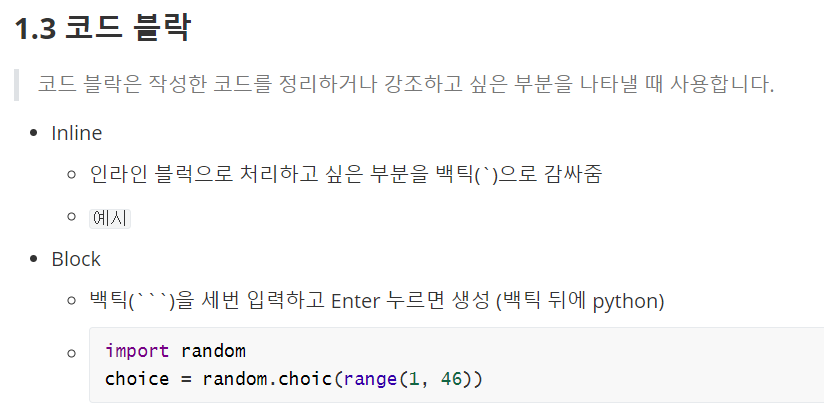

# 마크다운(markdown)

>  마크다운은 개발자들의 메모장


## 1.문법

### 1.1 Header

> 헤더는 제목을 표현할 때 사용합니다.

- h1(가장 큰 제목) 부터 h6(가장 작은 제목)까지 표현 가능합니다.
- #의 개수로 표현합니다.

### 1.2 List

> 목록을 나열할 때 사용합니다. 순서가 있거나 없는 목록을 만들 수 있습니다.

1. 순서가 있는 목록 
   1. tab 누르면 이렇게 들여쓰기 됨
   2. shift + tab 누르면 상위 수준으로 돌아감

- 순서가 없는 목록
  	- -(하이픈)을 쓰고 스페이스바를 누르면 생성할 수 있음

### 1.3 코드 블락

> 코드 블락은 작성한 코드를 정리하거나 강조하고 싶은 부분을 나타낼 때 사용합니다.

- Inline

  - 인라인 블럭으로 처리하고 싶은 부분을 백틱(`)으로 감싸줌
  - `예시`

- Block 

  - 백틱(```)을 세번 입력하고 Enter 누르면 생성 (백틱 뒤에 python)

  - ```python
    import random
    choice = random.choic(range(1, 46))
    ```

### 1.4 이미지

- 참고: 윈도우(10)에서 `win` + `shift` + `s` 누르면 손쉽게 캡처가 가능
- github 올릴 때 이미지가 같이 올라가야 함



- `` 을 작성합니다.
  -  `()` 안에 이미지 주소를 입력합니다. 
  -  `[]` 안에는 이미지 파일의 이름을 작성합니다.


### 1.5 Link

> 특정 주소로 링크를 걸 때 사용합니다,

- `[]()` 을 작성합니다.
  - `()` 안에 링크 URL을, `[]` 안에 링크 주소의 Name을 작성합니다.
- [구글](https://www.google.com)

### 1.6 Table

> 표를 작성하여 요소를 구분할 수 있습니다.

- `|` (파이프) 사이에 컬럼을 작성하고, Enter를 누릅니다.

- 마지막을 파이프로 끝내주어야 합니다.

- `ctrl` + `enter` 하면 행 추가가 됩니다.

  | 이름   | 성별 | 나이   |
  | ------ | ---- | ------ |
  | 정선영 | 여자 | 비밀>< |

